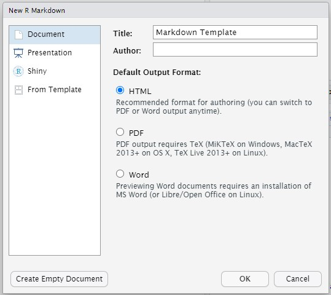
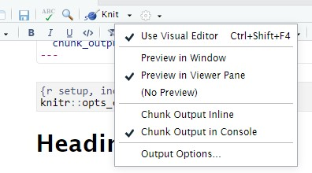
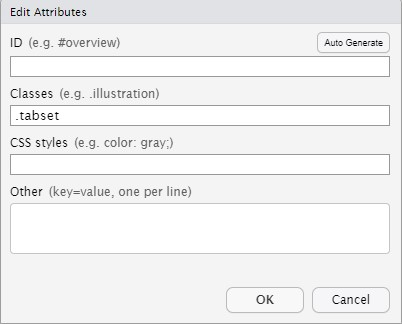
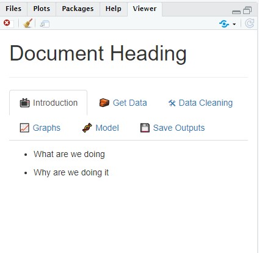

```{r setup, include=FALSE}
knitr::opts_chunk$set(echo = FALSE)
```

## Introduction

Markdown is a great way of presenting output. Here is my setup to get the most out of it.

## Create the Markdown File

This can be created in the usual way - file/new file from the RStudio menu.



## Change the Settings

Clicking on the cog at the top brings up some different options. I usually change these to be:

- Use Visual Editor
- Preview in Viewer Pane
- Chunk Output in Console



## Add in Tabset Classes

Tabsets allow readers to view the content of different sections by clicking the tab titles instead of scrolling back and forth on the page. They are a great way of laying out a piece of work. They can be created by adding a tabset class to the heading, either in the Markdown itself:

```{r, eval=FALSE, echo=TRUE}
# Document Heading {.tabset}
```

Or in the visual editor:



## Bonus: Use Emojis to make your Tabs Looks Awesome 
These can be pasted in from the Windows Emoji window:

